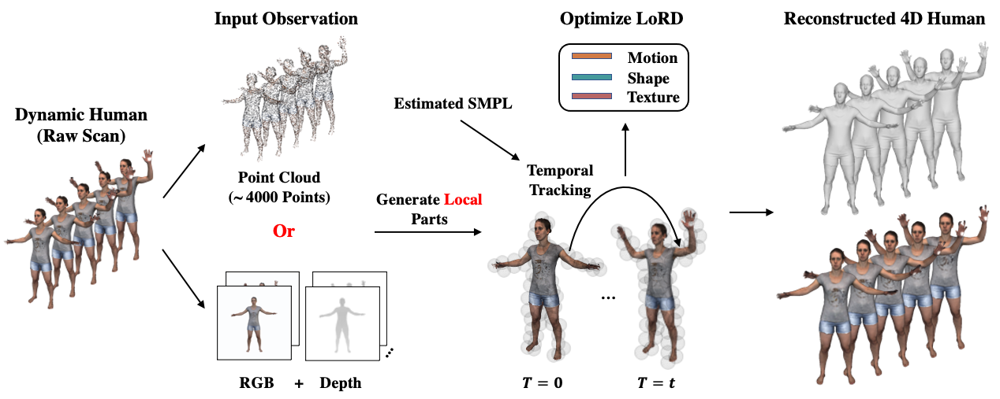

# Local 4D Representation for Dynamic Human

### [Project Page](https://boyanjiang.github.io/LoRD/) | [Video](https://youtu.be/dXuZVrmYKxg) | [Paper](https://arxiv.org/abs/2208.08622)



This repository contains the code for the ECCV'2022 paper
"LoRD: Local 4D Implicit Representation for High-Fidelity 
Dynamic Human Modeling".

In this paper, we introduce a local 4D implicit representation 
for dynamic human, which has the merits of both 4D human modeling 
and local representation, and enables high-fidelity reconstruction 
from sparse point clouds or RGB-D videos.

If you have any question, please contact Boyan Jiang  <byjiang18@fudan.edu.cn>.

#### Citation
If you use our code for any purpose, please consider citing:
```bibtex
@inProceedings{jiang2022lord,
  title={LoRD: Local 4D Implicit Representation for High-Fidelity Dynamic Human Modeling},
  author={Boyan Jiang and Xinlin Ren and Mingsong Dou and Xiangyang Xue and Yanwei Fu and Yinda Zhang},
  booktitle={ECCV},
  year={2022}
}
```

## Prerequisites
1. PyTorch (test with Python 3.7, PyTorch 1.5.1, CUDA 10.1 on Ubuntu 16.04)
2. PyTorch3D (https://github.com/facebookresearch/pytorch3d)
3. Chumpy
```
pip install ./chumpy
```
4. Other dependencies
```
pip install -r requirements.txt
```
5. Compile the extension module for evaluation
```
python setup.py build_ext --inplace
```

## Data and Model
### Dataset
The [CAPE dataset](https://cape.is.tuebingen.mpg.de/media/upload/CAPE_paper.pdf) 
is used for training and evaluation. Please check [the official website](https://cape.is.tue.mpg.de) for more details.

We provide some demo data and other necessary files in [this link](https://drive.google.com/file/d/1bqCe7lr1GNrC0h6r87l4_PwC67B8Teb6/view?usp=sharing) to show the usage of the code.
```
unzip lord_data.zip -d ./data
```

### Pre-trained Model
The LoRD model pre-trained on 100 motion sequences can be downloaded from 
[this link](https://drive.google.com/file/d/1W_nXWU5oKiWhXI2E_m3kI7OitkW0iAjF/view?usp=sharing).
Please unzip to the `out/lord/checkpoints` folder.
```
mkdir -p out/lord/checkpoints
unzip lord_model.zip -d out/lord/checkpoints
```

## Quick Demo
We prepare data samples for running the demo in `data` folder.
First, you need to process raw data by using:
```
python scripts/cape_data_process.py
```
This will create ground truth clothed meshes, SMPL body meshes, 
point cloud sequences for training and testing in `dataset` folder.

Then you can run LoRD on different types of input observations 
via following instructions:

```
# 4D Reconstruction from Sparse Points
python reconstruct.py lord \
--pcl_type pcl_test \
--exp_name fit_sparse_pcl \
--seq_name 03284_shortlong_simple_87

# Non-Rigid Depth Fusion
python scripts/depth2pcl.py  # convert depth images to oriented point clouds

python reconstruct.py lord \
--pcl_type depth_pcl \
--exp_name fit_depth_pcl \
--seq_name 00134_longlong_twist_trial2_21
```

**Note**: We only provide meshes without texture information due to 
data copyright considerations. The [CAPE raw scan](https://cape.is.tue.mpg.de/download.php) with texture 
is available upon request. If you have colored point clouds, please 
enable the `--texture` flag to trigger our texture model.

### Mesh Generation
When finishing the optimization of LoRD, 
you can generate mesh sequence via:
```
# 4D Reconstruction from Sparse Points
python generate_mesh.py lord \
--exp_name fit_sparse_pcl \
--pcl_type pcl_test \
--seq_name 03284_shortlong_simple_87

# Non-Rigid Depth Fusion
python generate_mesh.py lord \
--exp_name fit_depth_pcl \
--pcl_type depth_pcl \
--seq_name 00134_longlong_twist_trial2_21
```


### Inner Body Refinement
The above demos use ground truth SMPL meshes by default,
you can also estimate SMPL parameters by 4D representation method [H4D](https://github.com/BoyanJIANG/H4D).
We provide the demo code to use our Inner Body Refinement:

1. Use the Linear Motion Model (PCA layer) from H4D to fit the input point clouds.
```
python h4d_fitting.py \
--pcl_type depth_pcl \
--seq_name 02474_longshort_ROM_lower_258
```
The fitted SMPL meshes can be found in `dataset/02474_longshort_ROM_lower_258`.

2. Optimize LoRD with the initial estimated SMPL.
```
python reconstruct.py lord \
--pcl_type depth_pcl \
--exp_name fit_depth_pcl_h4d_pose \
--seq_name 02474_longshort_ROM_lower_258 \
--use_h4d_smpl
```

3. Refine the initial SMPL estimation and perform optimization with the refined SMPL.
```
python reconstruct.py lord \
--pcl_type depth_pcl \
--exp_name fit_depth_pcl_h4d_pose_refine \
--seq_name 02474_longshort_ROM_lower_258 \
--use_h4d_smpl \
--smpl_refine
```

The optimization results will be saved in `out/lord/fit_depth_pcl_h4d_pose_refine`.


## Training
You can train LoRD model from scratch via:
```
python train.py lord
```


## Evaluation
We borrow some codes from [ONet](https://github.com/autonomousvision/occupancy_networks)
to evaluate the accuracy of reconstructed shapes with Chamfer 
Distance, Normal Consistency and F-Score. Please check `eval.py`
for more details.


## Further Information
This project is related to [LIG](https://github.com/tensorflow/graphics/blob/master/tensorflow_graphics/projects/local_implicit_grid/README.md),
[OFLow](https://github.com/autonomousvision/occupancy_flow),
[4D-CR](https://github.com/BoyanJIANG/4D-Compositional-Representation),
and [H4D](https://github.com/BoyanJIANG/H4D).
If you are interested in local 3D representation and 4D representation, please check their projects which are previous works in these areas.


## License
Apache License Version 2.0